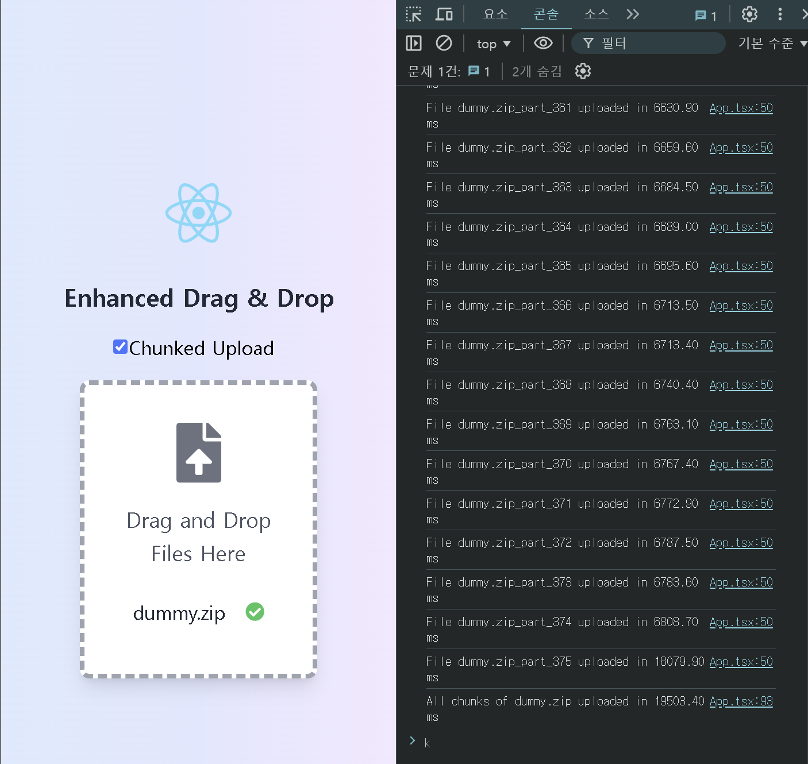
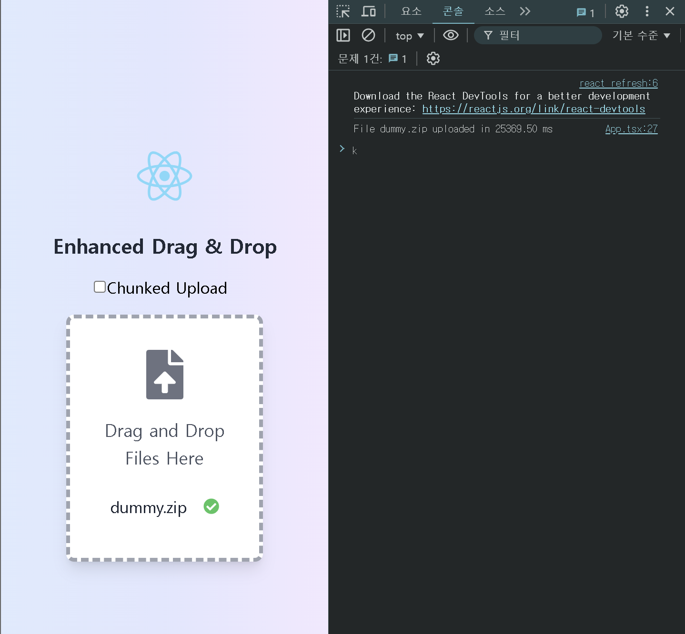

# large-file-processing-demo
## 1. Design
### 1-1. Flow Diagram

1. Split MP4 files into chunks.
2. Send chunk file from client to server
3. Integrate chunk files

### 1-2. Goal
- Enhance the efficiency of processing and transferring large files by effectively splitting MP4 files into chunks for seamless transmission and integration.
- Improve the user experience by allowing users to upload files without delays, ensuring a smooth and responsive interface.
- Optimize server resources to maintain stable and efficient file processing, minimizing downtime and bottlenecks.

### 1-3. Key Points
1. Efficiently handle large volumes of data using a message broker for low overhead and increased throughput.
2. Utilize asynchronous and non-blocking operations to achieve optimal speed and responsiveness.
3. Implement sequence numbers in chunk files to guarantee the correct order during integration, preventing data integrity issues.

## 2. Implementation
### 2-1. Speed comparison between chunked and regular methods (Based on 2GB file)
* **Chunked Upload(Promise parallel processing)**
  
    

    >average latency : 19000 ms

* **Non Chunked Upload**
  
    

    >average latency : 25000 ms

#### Conclusion
Transmitting files in chunks uses less bandwidth compared to sending the entire file at once, and it also allows for parallel processing, resulting in faster speeds.

## 3. Reference
* frontend : https://github.com/KNU-K/large-file-processing-fe-demo